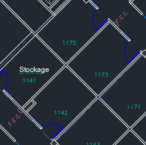
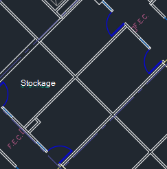
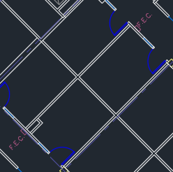
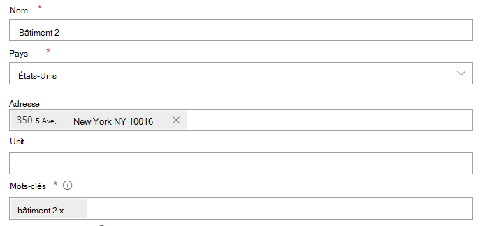
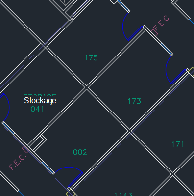

# Gérer les plans d’étage

Les plans d’étage de **Microsoft Search** aident les utilisateurs à trouver des personnes et des salles de réunion au sein d’un bâtiment. Les plans d’étage répondent aux questions suivantes :

- Où se trouve Allan Young Office ?
- Bâtiment 2 étage 3
- Rechercher 2/11173

## Ajouter des plans d’étage

Suivez ces étapes pour configurer les réponses des plans d’étage dans **Microsoft Search**.

### Étape 1 : déterminer vos codes de bâtiment

Les codes de construction sont utilisés dans l’emplacement du Bureau d’un utilisateur. Vous utiliserez ces codes lors de la mise à jour des profils utilisateur. Imaginons que votre organisation ait un immeuble à cet emplacement : *bâtiment 2, 350 5ème Avenue, New York City, NY 10016*

Voici quelques exemples intéressants pour le code de ce bâtiment : 2, B2, Building2, bâtiment 2 ou NYCB2. Chaque bâtiment doit avoir un code unique.

### Étape 2 : passer en revue vos plans d’étage

Les fichiers de plans d’étage doivent être au format DWG ; Les fichiers DWG peuvent contenir des étiquettes de texte. Lorsqu’une étiquette de texte marque une salle, elle est appelée « étiquette de salle ». Le fichier DWG doit comporter **au moins 10 salles** marquées par des étiquettes. Voici quelques exemples de fichiers DWG avec différents types d’étiquettes :

|**Étiquettes de texte, y compris les étiquettes de salle**|**Étiquettes de texte, mais pas d’étiquettes de salle**|**Aucune étiquette de texte**|
|:-----:|:-----:|:-----:|
||||

Pour plus d’informations sur l’affichage et la mise à jour des fichiers DWG, voir la section [Forum aux questions](#frequently-asked-questions) .

### Étape 3 : mettre à jour les emplacements Office sur les profils utilisateur

L’emplacement du Bureau d’un utilisateur est une combinaison d’un code de bâtiment et d’une étiquette de salle. Par exemple, si le code de bâtiment est *2* et l’étiquette de salle est *1173*, l’emplacement du bureau sera *2/1173*.

Ajoutez ou mettez à jour des emplacements Office pour chaque utilisateur de votre organisation. Vous pouvez modifier l’emplacement du Bureau sur le profil utilisateur dans le [Centre d’administration](https://admin.microsoft.com) 365 de Microsoft ou vous pouvez modifier votre annuaire Active Directory local afin de le synchroniser dans Azure Active Directory. *PhysicalDeliveryOfficeName* est le champ utilisé pour l’emplacement du bureau. Si les étiquettes de votre salle n’incluent pas de numéros de plancher, consultez le Forum aux questions pour obtenir des conseils.

Dans cet exemple, le Bureau de Allan se trouve dans la salle 1173 sur le plancher 1 du bâtiment 2.

> [!NOTE]
> Pour consulter les emplacements Office mis à jour lors de la recherche de plans d’étage, vous devez mettre à jour les emplacements Office pour **au moins 10 personnes** à chaque étage.

### Étape 4 : vérifier l’emplacement du Bureau

Utilisez **Microsoft Search** pour rechercher un utilisateur et vérifier que son emplacement de bureau s’affiche correctement. Si vous venez de mettre à jour des emplacements, vous devrez peut-être patienter jusqu’à **72 heures** pour que les mises à jour apparaissent dans les résultats de la recherche.

### Étape 5 : ajouter des emplacements de création

Plans d’étage utilise des [emplacements](manage-locations.md) pour définir vos bâtiments. Dans le centre d' [administration](https://admin.microsoft.com)Microsoft 365, accédez à **paramètres**  >  **Microsoft Search**  >  **locations**, puis sélectionnez **Ajouter**. Entrez le nom, l’adresse et les mots clés pour le bâtiment. Ajoutez autant de bâtiments que vous le souhaitez.

Pour plus d’informations sur les emplacements, voir [Manage locations](manage-locations.md)

### Étape 6 : Collectez et organisez les emplacements de bureau

Pour pouvoir utiliser les plans d’étage, les emplacements de bureau doivent être indexés. Il s’agit d’une opération ponctuelle pouvant prendre jusqu’à 48 heures. La durée totale dépend de la taille de votre organisation.

Dans le [Centre d’administration](https://admin.microsoft.com), accédez à **paramètres**  >  **Microsoft Search**  >  **Floor plans**, puis sélectionnez **prise en main**. Si vous ne voyez pas cette notification, cette étape a déjà été effectuée pour votre organisation.

### Étape 7 : chargement des plans d’étage

1. Dans le [Centre d’administration](https://admin.microsoft.com), accédez à **paramètres**  >  **Microsoft Search**  >  **Floor plans**, puis sélectionnez **Ajouter**.
2. Sélectionnez un immeuble dans la liste déroulante, puis cliquez sur **suivant**. Si le bâtiment n’est pas indiqué, revenez en arrière et [Ajoutez des emplacements de construction](#step-5-add-building-locations).
3. Sélectionnez **Télécharger les fichiers**, puis choisissez le plan d’étage que vous téléchargez.
4. Lorsque le téléchargement est terminé, vous devez entrer le numéro d’étage représenté dans le fichier de plan d’étage. Ensuite, sélectionnez **Suivant**.
5. Module Si votre étage comporte des ailes ou des zones, entrez ces détails.
6. Vous verrez un écran de révision répertoriant le nombre d’emplacements Office mappés sur les plans d’étage. Sélectionnez **Détails** pour vérifier que le mappage est correct.
    - Si aucun utilisateur n’est mappé ou si vous n’êtes pas satisfait du mappage, sélectionnez **continuer le mappage**. Pour publier, sélectionnez **ignorer et publier**.
7. Entrez le code de bâtiment pour ce plan d’étage. Le code de bâtiment se trouve dans la propriété de l’emplacement du Bureau des utilisateurs. Par exemple, si l’emplacement du Bureau d’un utilisateur est **2/1173**, le code de bâtiment est **2**.
8. Sur l’écran révision, répétez l’étape 6 pour vous assurer que le mappage est correct.
9. Module Examinez et identifiez les modèles d’emplacement pour tous les plans d’étage téléchargés, puis sélectionnez **suivant**.
10. Sur l’écran révision, répétez l’étape 6 pour vous assurer que le mappage est correct.
11. Lorsque vous êtes prêt, sélectionnez **publier** pour mettre le plan d’étage à disposition dans **Microsoft Search**.

> [!NOTE]
> **Il faut 48 heures pour que les plans d’étage soient publiés.** Une fois que les utilisateurs voient un plan d’étage semblable à celui ci-dessous lorsqu’ils recherchent le Bureau d’un collègue.

### Étape 8 : spécification des modèles d’emplacement

Après avoir téléchargé un plan d’étage, les étiquettes de texte sont comparées aux emplacements de bureau dans les profils de vos utilisateurs. S’il y a moins de 10 correspondances, l’écran **spécifier les modèles d’emplacement** s’affiche. Les modèles d’emplacement sont utilisés pour extraire les informations d’étage, d’aile et de salle des bureaux.

Seule une salle est requise, le plancher et l’aile sont facultatifs et vous pouvez ignorer les emplacements selon vos besoins.

## Modifier les plans d’étage

Pour mettre à jour un plan d’étage existant, sélectionnez le plan d’étage que vous souhaitez modifier, puis sélectionnez **modifier**. Effectuez vos modifications et enregistrez-les.

## Résolution des problèmes

|**Étape**|**Message d’erreur**|**Type**|**Action**|
|:-----|:-----|:-----|:-----|
|Chargement des plans d’étage|Impossible de lire CC_1. dwg. Rechargez ou supprimez le plan d’étage.|Erreur|Essayez de recharger le fichier. Si cela ne fonctionne pas, supprimez le fichier et réessayez.|
|Chargement des plans d’étage|Il existe deux fichiers nommés CC_1. dwg. Supprimez l’un d’entre eux ou rechargez-le à l’aide d’un autre nom.|Erreur|Si le nom de fichier est incorrect, rendez le nom de fichier unique en ajoutant des informations d’étage ou d’aile, puis téléchargez de nouveau le fichier. Si vous avez accidentellement ajouté le même fichier deux fois plus simplement, supprimez-le.|
|Chargement des plans d’étage|Aucune donnée n’a été trouvée.|Erreur|Vérifiez que le fichier est correct, puis téléchargez-le à nouveau ou supprimez-le.|
|Chargement des plans d’étage|Des références externes sont manquantes dans ce fichier. Téléchargez CC_1_furniture. DWG ou supprimez ce fichier.|Avertissement|Télécharger des fichiers de référence externes ou supprimer.|
|Chargement des plans d’étage|Impossible de lire les numéros de pièces ou les balises dans le fichier DWG. Veuillez supprimer ce fichier.|Avertissement|Vérifiez que les données sont incluses dans votre fichier DWG, puis supprimez le fichier, puis réessayez.|
|Lier des emplacements de bureau|Aucun emplacement de bureau n’a été trouvé dans Azure Active Directory. Ajoutez des données de localisation à Azure Active Directory avant de configurer les plans d’étage.|Erreur|[Mettre à jour les emplacements Office dans les profils utilisateur](#step-3-update-office-locations-on-user-profiles) |

## Foire aux questions

**Q :** Comment afficher et modifier des fichiers DWG ?

**A :** Utilisez l’une des options suivantes pour afficher les fichiers DWG :

- Téléchargez le fichier sur SharePoint et ouvrez-le.
- Ouvrez le fichier dans [Microsoft Visio](https://support.office.com/article/Open-insert-convert-and-save-DWG-and-DXF-AutoCAD-drawings-60cab691-0f4c-4fc9-b775-583273c8dac5) ou [Autodesk DWG TrueView](https://www.autodesk.com/products/dwg).
- Téléchargez le fichier dans la [visionneuse en ligne d’Autodesk](https://viewer.autodesk.com/).

**Q :** Comment ajouter des étiquettes de texte à des salles non marquées ?

**A :** Ouvrir le fichier DWG dans un éditeur et [Ajouter des étiquettes de salle](https://knowledge.autodesk.com/support/autocad-map-3d/learn-explore/caas/CloudHelp/cloudhelp/2019/ENU/MAP3D-Learn/files/GUID-4854F184-6279-4E0C-9487-34A4759017F6-htm.html).

**Q :** Comment créer ou modifier des fichiers DWG à des fins de test ?

**A :** Créez un fichier DWG dans Microsoft Visio, Autodesk AutoCAD ou dans un autre éditeur DWG. Assurez-vous que 10 salles ou plus sont étiquetées dans le fichier.

**Q :** * * quelle est la meilleure mise en forme pour les étiquettes de texte dans les fichiers DWG ?

**A :** Pour obtenir les meilleurs résultats, les étiquettes de texte doivent contenir les numéros de plancher et de chambre. Les exemples ci-dessous utilisent 2 ou SC pour le code de bâtiment.
<!-- markdownlint-disable no-inline-html -->
|Types d’étiquettes de salle|Floor|Room|Exemple d’étiquette de texte|Emplacement du Bureau (génération de code/étiquette de texte)|
|:-----|:-----|:-----|:-----|:-----|
|Comprend le plancher et le numéro de la salle|1 |173|1173|2/1173|
|| 21|45|21045|2/21045|
||23|Ko|23-100 000|2/23-100 000|
||1 |G06-07|1G06-07|2/1G06-07|
||2 |1024|02.1024 a|2/02.1024 a|
||2 |1024|02.1024 a|2/02.1024 a|
||2 |105,01|2105,01|2/2105.01|
|A le code de génération, le plancher et le numéro de la salle|0|X-11-M-12|2-0-X-11-M-12|2/2 -0-X-11-M-12 2-0-X-11-M-12|
||2 |128A|22128A|2/22128A 22128A|
||1 |B2-11|21-B2-11|2/21-B2-11 21-B2-11|
||2 |45|SC2045|SC/SC2045 SC2045|

**Q :** Puis-je utiliser un fichier DWG qui n’inclut pas de numéros de plancher ?

**A :** Si, tu peux. Lorsque vous mettez à jour des emplacements Office dans le profil Azure Active Directory de l’utilisateur, incluez le numéro d’étage dans le numéro de la pièce, même s’il ne figure pas dans le fichier DWG. Après avoir téléchargé le fichier, l’écran spécifier les modèles d’emplacement s’affiche et vous pouvez indiquer les deux valeurs.

Par exemple, un fichier DWG qui inclut des numéros de pièces, mais pas de numéros de plancher, peut ressembler à ceci :

L’emplacement du bureau dans le profil de l’utilisateur doit être 2/1175 où « 2 » est le code de bâtiment, « 1 » le numéro d’étage et « 175 » le numéro de la pièce.
