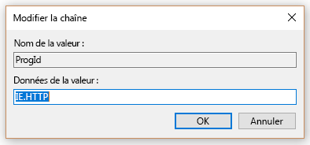

# Configurer la configuration par défaut

La configuration du navigateur par défaut, le moteur de recherche par défaut et la page d’accueil par défaut aideront vos utilisateurs à découvrir les fonctionnalités de Microsoft Search (recherche Microsoft), à plus encourager l’utilisation et offrir une expérience plus fluide.
  
Pour définir le navigateur par défaut pour votre organisation, suivez les étapes ci-dessous.
  
## Windows 8 ou version ultérieure

Pour définir Internet Explorer ou Microsoft Edge comme navigateur par défaut, procédez comme suit :
  
### Créez le fichier d’associations par défaut

1. Ouvrez une console d’administration PowerShell.
    
2.  `New-Item -Path "\\$env:USERDOMAIN\SYSVOL\$env:USERDNSDOMAIN" -Type Directory -Name "Settings"`
    
3.  `$SettingsPath="\\$env:USERDOMAIN\SYSVOL\$env:USERDNSDOMAIN\Settings"`
    
4.  `Start-Process Dism.exe -PassThru "/Online /Export-DefaultAppAssociations:$SettingsPath\AppAssoc.xml"`
    
Ces étapes essaient et créent le fichier d’associations par défaut dans le dossier SYSVOL du contrôleur de domaine.
  
### Ajoutez ou modifiez le fichier d’associations par défaut

1. `Notepad "$SettingsPath\AppAssoc.xml"`
    
2. Modifier les entrées suivantes (.htm, .html, http, https) et supprimez les autres entrées si elles ne sont pas utilisées.
    
  - **Microsoft Edge**
    
     `<Association Identifier=".htm" ProgId="AppX4hxtad77fbk3jkkeerkrm0ze94wjf3s9" ApplicationName="Microsoft Edge" />`
  
     `<Association Identifier=".html" ProgId="AppX4hxtad77fbk3jkkeerkrm0ze94wjf3s9" ApplicationName="Microsoft Edge" />`
  
     `<Association Identifier="http" ProgId="AppXq0fevzme2pys62n3e0fbqa7peapykr8v" ApplicationName="Microsoft Edge" />`
    
  - **Internet Explorer**
    
     `<Association Identifier=".htm" ProgId="htmlfile" ApplicationName="Internet Explorer" />`
  
     `<Association Identifier=".html" ProgId="htmlfile" ApplicationName="Internet Explorer" />`
  
     `<Association Identifier="http" ProgId="IE.HTTP" ApplicationName="Internet Explorer" />`
  
     `<Association Identifier="https" ProgId="IE.HTTPS" ApplicationName="Internet Explorer" />`
    
3. Ouvrez la Console de gestion des stratégies de groupe (gpmc.msc) et basculez vers modifier toute stratégie existante ou créer un nouveau.
    
1. Accédez à**Configuration ordinateur\Administration administrative\Composants Windows\Dossier Explorer**
    
2. Double-cliquez sur **définir un fichier de configuration d’associations par défaut**, définissez-le comme programme **Activé**, puis entrez le chemin d’accès à AppAssoc.xml (par exemple %USERDOMAIN%\SYSVOL\%USERDNSDOMAIN%\Settings\ AppAssoc.xml)
    
4. Appliquez la stratégie de groupe résultante GPO en les reliant au domaine approprié.
    
Les utilisateurs pourront modifier le navigateur après avoir défini cette stratégie.
  
## Windows 7

1. Configurez l’ordinateur local destiné à être utilisé pour définir la stratégie de groupe (GPO).
    
1. Ouvrez le**programmes par défaut de contrôle\Programmes\Programmes par défaut\Définir les programmes par défaut** et définir Internet Explorer par défaut. 
    
2. Ouvrez la Console de gestion des stratégies de groupe (gpmc.msc) et basculez vers modifier toute stratégie existante ou créer un nouveau.
    
1. Accédez à ** \<Ordinateur/Utilisateur\> Configuration\Stratégies\Préférences\Paramètres Windows**.
    
2. Avec le bouton droit cliquez sur **Registre\Nouveauté** et sélectionnez **Assistant Registre**.
    
3. Dans la fenêtre du navigateur de Registre, sélectionnez **Ordinateur Local** sur **Suivant**.
    
4. Accédez à **HKEY_CURRENT_USER\Software\Microsoft\Windows\Shell\Associations\UrlAssociations\https** et sélectionnez la valeur ProgId. Vérifiez que la valeur semblable à celui ci-dessous : 
    
    
  
5. Accédez à **HKEY_CURRENT_USER\Software\Microsoft\Windows\Shell\Associations\UrlAssociations\https** et sélectionnez la valeur ProgId. Vérifiez que la valeur semblable à celui ci-dessous : 
    
    
  
3. Appliquez la stratégie de groupe résultante GPO en les reliant au domaine approprié.
    
Les utilisateurs pourront modifier le navigateur après avoir défini cette stratégie.