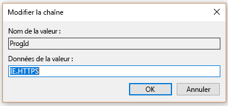

# Configurer la configuration par défautSet default browser

La configuration du navigateur par défaut, le moteur de recherche par défaut et la page d’accueil par défaut aideront vos utilisateurs à découvrir les fonctionnalités de Microsoft Search (recherche Microsoft), à plus encourager l’utilisation et offrir une expérience plus fluide.Configuring the default browser, default search engine, and default homepage will help your users discover Microsoft Search capabilities, encourage more usage, and provide a smoother experience.
  
Pour définir le navigateur par défaut pour votre organisation, suivez les étapes ci-dessous.To set the default browser for your organization, follow the steps below.
  
## Windows 8 ou version ultérieureWindows 8 and above

Pour définir Internet Explorer ou Microsoft Edge comme navigateur par défaut, procédez comme suit :To set Internet Explorer or Microsoft Edge as the default browser, follow these steps:
  
### Créez le fichier d’associations par défautCreate default associations file

1. Ouvrez une console d’administration PowerShell.Open an administrative PowerShell console.
    
2.  `New-Item -Path "\\$env:USERDOMAIN\SYSVOL\$env:USERDNSDOMAIN" -Type Directory -Name "Settings"`
    
3.  `$SettingsPath="\\$env:USERDOMAIN\SYSVOL\$env:USERDNSDOMAIN\Settings"`
    
4.  `Start-Process Dism.exe -PassThru "/Online /Export-DefaultAppAssociations:$SettingsPath\AppAssoc.xml"`
    
Ces étapes essaient et créent le fichier d’associations par défaut dans le dossier SYSVOL du contrôleur de domaine.These steps try and create the default associations file in the SYSVOL folder of the domain controller.
  
### Ajoutez ou modifiez le fichier d’associations par défautAdd or edit the default associations file

1. `Notepad "$SettingsPath\AppAssoc.xml"`
    
2. Modifier les entrées suivantes (.htm, .html, http, https) et supprimez les autres entrées si elles ne sont pas utilisées.Edit the following entries (.htm, .html, http, https), and remove other entries if they're not needed.
    
  - **Microsoft Edge****Microsoft Edge**
    
     `<Association Identifier=".htm" ProgId="AppX4hxtad77fbk3jkkeerkrm0ze94wjf3s9" ApplicationName="Microsoft Edge" />`
  
     `<Association Identifier=".html" ProgId="AppX4hxtad77fbk3jkkeerkrm0ze94wjf3s9" ApplicationName="Microsoft Edge" />`
  
     `<Association Identifier="http" ProgId="AppXq0fevzme2pys62n3e0fbqa7peapykr8v" ApplicationName="Microsoft Edge" />`
    
  - **Internet Explorer****Internet Explorer**
    
     `<Association Identifier=".htm" ProgId="htmlfile" ApplicationName="Internet Explorer" />`
  
     `<Association Identifier=".html" ProgId="htmlfile" ApplicationName="Internet Explorer" />`
  
     `<Association Identifier="http" ProgId="IE.HTTP" ApplicationName="Internet Explorer" />`
  
     `<Association Identifier="https" ProgId="IE.HTTPS" ApplicationName="Internet Explorer" />`
    
3. Ouvrez la Console de gestion des stratégies de groupe (gpmc.msc) et basculez vers modifier toute stratégie existante ou créer un nouveau.Open Group Policy Management Console (gpmc.msc) and switch to editing any existing policy or creating a new one.
    
1. Accédez à**Configuration ordinateur\Administration administrative\Composants Windows\Dossier Explorer**Navigate to **Computer Configuration\Administrative Templates\Windows Components\File Explorer**
    
2. Double-cliquez sur **définir un fichier de configuration d’associations par défaut**, définissez-le comme programme **Activé**, puis entrez le chemin d’accès à AppAssoc.xml (par exemple %USERDOMAIN%\SYSVOL\%USERDNSDOMAIN%\Settings\ AppAssoc.xml)Double-click **Set a default associations configuration file**, set it to **Enabled**, and enter the path to AppAssoc.xml (for example %USERDOMAIN%\SYSVOL\%USERDNSDOMAIN%\Settings\AppAssoc.xml)
    
4. Appliquez la stratégie de groupe résultante GPO en les reliant au domaine approprié.Enforce the resultant GPO by linking it to the appropriate domain.
    
Les utilisateurs pourront modifier le navigateur après avoir défini cette stratégie.Users will be able to change the browser after this policy is set.
  
## Windows 7Windows 7

1. Configurez l’ordinateur local destiné à être utilisé pour définir la stratégie de groupe (GPO).Configure the local machine that will be used to set the GPO.
    
1. Ouvrez le**programmes par défaut de contrôle\Programmes\Programmes par défaut\Définir les programmes par défaut** et définir Internet Explorer par défaut.Open **Control Panel\Programs\Default Programs\Set Default Programs** and set Internet Explorer as the default. 
    
2. Ouvrez la Console de gestion des stratégies de groupe (gpmc.msc) et basculez vers modifier toute stratégie existante ou créer un nouveau.Open Group Policy Management Console (gpmc.msc) and switch to editing any existing policy or creating a new one.
    
1. Accédez à \*\* \<Ordinateur/Utilisateur\> Configuration\Stratégies\Préférences\Paramètres Windows\*\*.Navigate to **\<Computer/User\> Configuration\Policies\Preferences\Windows Settings**.
    
2. Avec le bouton droit cliquez sur **Registre\Nouveauté** et sélectionnez **Assistant Registre**.Right-click on **Registry\New** and select **Registry Wizard**.
    
3. Dans la fenêtre du navigateur de Registre, sélectionnez **Ordinateur Local** sur **Suivant**.From the Registry Browser window, select **Local Computer** and click **Next**.
    
4. Accédez à **HKEY_CURRENT_USER\Software\Microsoft\Windows\Shell\Associations\UrlAssociations\https** et sélectionnez la valeur ProgId. Vérifiez que la valeur semblable à celui ci-dessous :Navigate to **HKEY_CURRENT_USER\Software\Microsoft\Windows\Shell\Associations\UrlAssociations\https** and select the ProgId value. Make sure the value looks like the one below: 
    
    
  
5. Accédez à **HKEY_CURRENT_USER\Software\Microsoft\Windows\Shell\Associations\UrlAssociations\https** et sélectionnez la valeur ProgId. Vérifiez que la valeur semblable à celui ci-dessous :Navigate to **HKEY_CURRENT_USER\Software\Microsoft\Windows\Shell\Associations\UrlAssociations\https** and select the ProgId value. Make sure that the value looks like the one below: 
    
    
  
3. Appliquez la stratégie de groupe résultante GPO en les reliant au domaine approprié.Enforce the resultant GPO by linking it to the appropriate domain.
    
Les utilisateurs pourront modifier le navigateur après avoir défini cette stratégie.Users will be able to change the browser after this policy is set.