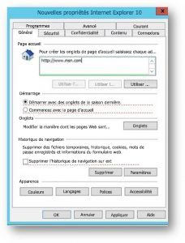

# Page d’accueil par défaut du jeu

Configurer le navigateur par défaut, le moteur de recherche par défaut et la page d’accueil par défaut vous aidera vos utilisateurs découvrir les fonctionnalités de Microsoft Search, encourager l’utilisation de plus et fournir une meilleure expérience.
  
Pour définir la page d’accueil par défaut pour votre organisation, procédez comme suit.
  
## Internet Explorer

### Internet Explorer 5.0 ou version ultérieure

1. Ouvrez la Console de gestion de stratégie de groupe (gpmc.msc) et passer à la modification d’une stratégie existante ou créer un nouveau.
    
2. Accédez aux **paramètres de Windows\Maintenance Internet utilisateur Configuration\Preferences\Control du Panneau de configuration**.
    
3. Avec le bouton droit sur les **Paramètres Internet** et sélectionnez **Internet Explorer 10**.
    
    > [!NOTE]
    > Vous devez sélectionner l’option d’Internet Explorer 10 pour appliquer les paramètres d’Internet Explorer 11 les mêmes paramètres s’appliquent à Internet Explorer 11. 
  
4. Les paramètres qui sont soulignés en rouge ne sont pas configurés au niveau de l’ordinateur cible, tandis que les paramètres soulignés en vert sont configurés au niveau de l’ordinateur cible. Pour modifier le soulignement, utilisez les touches de fonction suivantes :
    
    F5 - activer tous les paramètres sous l’onglet en cours
    
    F6 - activer le paramètre actuellement sélectionné
    
    F7 - désactiver le paramètre actuellement sélectionné
    
    F8 - désactiver tous les paramètres sous l’onglet en cours
    
5. Appuyez sur la touche **F8** pour désactiver tous les paramètres avant de configurer rien. L’écran doit se présenter comme suit : 
    
    
  
6. Appuyez sur **F6** dans la page d’accueil de paramètre et entrez`https://www.bing.com/business?form=BFBSPR`
    
7. Appliquer la stratégie de groupe qui en découlent à lier au domaine approprié.
    
> [!NOTE]
> Les utilisateurs peuvent toujours modifier la page d’accueil une fois que cette stratégie est définie. 
  
## Microsoft Edge

### Windows 10, 1511 ou Version ultérieure

1. Ouvrez la Console de gestion de stratégie de groupe (gpmc.msc) et passer à la modification d’une stratégie existante ou créer un nouveau.
    
2. Accédez à **administration administration\Composants Components\Microsoft Edge**
    
1. Double-cliquez sur **des pages de configuration de démarrage**, définissez-la sur **activé**, puis entrez`https://www.bing.com/business`
    
3. Appliquer la stratégie de groupe qui en découlent à lier au domaine approprié.
    
> [!CAUTION]
> Les utilisateurs ne pourront pas modifier le fournisseur de recherche une fois que cette stratégie est définie. 
  
## Google Chrome

### Windows XP SP2 ou version ultérieure

L’article de la prise en charge de Windows sur la gestion des fichiers ADMX et les fichiers ADMX le plus récent pour les différentes versions de Windows se trouvent [sur le support technique Microsoft](https://support.microsoft.com/en-us/help/3087759/how-to-create-and-manage-the-central-store-for-group-policy-administra).

Vous devez également le fichier de stratégie Google le plus récent, vous pouvez trouver dans [l’Aide de Google Chrome Enterprise](https://support.google.com/chrome/a/answer/187202).
  
Si les paramètres décrits dans cette section est introuvable à l’intérieur de la console GPMC, téléchargez le ADMX approprié et les copier dans le [magasin central](https://docs.microsoft.com/en-us/previous-versions/windows/it-pro/windows-vista/cc748955%28v%3dws.10%29). Magasin central sur le contrôleur est un dossier avec la convention d’affectation de noms suivante :
  
 **%systemroot%\sysvol\\<domain\>\policies\PolicyDefinitions**
  
Chaque domaine les poignées de votre contrôleur doivent obtenir un dossier distinct. La commande suivante peut être utilisée pour copier le fichier ADMX à partir de l’invite de commandes :
  
 `Copy <path_to_ADMX.ADMX> %systemroot%\sysvol\<domain>\policies\PolicyDefinitions`
  
1. Ouvrez la Console de gestion de stratégie de groupe (gpmc.msc) et passer à la modification d’une stratégie existante ou créer un nouveau.
    
2. Assurez-vous que les dossiers suivants apparaissent dans la section **Modèles d’administration** de deux *Configuration utilisateur/ordinateur*: Google Chrome et Google Chrome - paramètres par défaut (modifiable).
    
   - Les paramètres de la première section sont fixes et l’administrateur local ne sera pas en mesure de les modifier.
    
   - Les paramètres de la section de ce dernier de stratégies peuvent être modifiés par les utilisateurs dans leurs paramètres de navigateur. Vous devez décider si les utilisateurs peuvent remplacer le paramètre par défaut. Dans les étapes suivantes, modifier dans le paramètre dans le dossier qui correspond à vos besoins et la stratégie de l’organisation. Les étapes ci-dessous utilisent le Google Chrome - paramètres par défaut, la valeur par défaut.
    
3. Accédez à ** &lt;Configuration ordinateur/utilisateur&gt;\Administrative Templates\Google Chrome - par défaut Settings\Home Page**.
    
4. Double-cliquez sur la **Page du nouvel onglet utilisation en tant que page d’accueil**et définissez-la sur **activé**.
    
5. Accédez à ** &lt;Configuration ordinateur/utilisateur&gt;\Administrative Templates\Google Chrome - Page de l’onglet par défaut Settings\New**.
    
6. Double-cliquez sur **configuration de la nouvelle URL de Page d’onglet**, définissez-la sur **activé**, puis entrez`https://www.bing.com/business?form=BFBSPR`
    
7. Appliquer la stratégie de groupe qui en découlent à lier au domaine approprié.
    
Les utilisateurs seront en mesure de modifier la page d’accueil une fois que cette stratégie est définie.