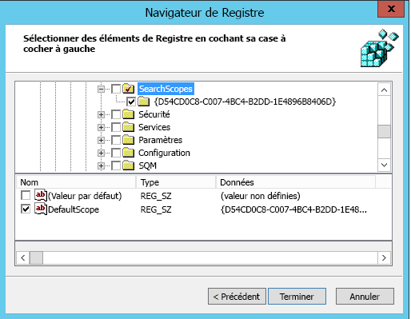

# Définir Bing en tant que moteur de recherche par défaut
  
Cet article vous explique comment configurer Bing en tant que moteur de recherche par défaut pour Microsoft Edge, Google Chrome et Internet Explorer. 
  
## Microsoft Edge sur Windows 10, version 1703 ou ultérieure

Bien que vous puissiez définir Bing en tant que moteur de recherche par défaut, Microsoft Edge autorise les utilisateurs à modifier leurs paramètres de manière à utiliser un autre moteur de recherche.
  
Concernant les fichiers récents d’ADMX relatifs aux différentes versions de Windows, reportez-vous à l’article [Comment créer et gérer le magasin central des modèles d’administration de stratégie de groupe dans Windows](https://support.microsoft.com/help/3087759/how-to-create-and-manage-the-central-store-for-group-policy-administra).
  
Si le paramètre décrit dans cette section est in trouver dans gpMC, téléchargez le ADMX approprié et copiez-le dans le magasin central. Pour plus d’informations, voir [Modification de Domain-Based de groupe à l’aide de fichiers ADMX.](https://docs.microsoft.com/previous-versions/windows/it-pro/windows-vista/cc748955%28v%3dws.10%29) Le magasin central sur le contrôleur est un dossier avec la convention d’attribution de noms suivante : **%systemroot%\sysvol \\<domain \> \policies\PolicyDefinitions**
  
Chaque domaine que votre contrôleur gère doit avoir un dossier séparé. La commande suivante peut être utilisée pour copier le fichier ADMX à partir de la commande rapide:
  
 `Copy <path_to_ADMX.ADMX> %systemroot%\sysvol\<domain>\policies\PolicyDefinitions`
  
1. Ouvrez la Console de Gestion des Stratégies de Groupe (gpmc.msc) et basculez vers modifier toute stratégie existante ou créer un nouveau.
2. Accédez à **&lt;Ordinateur/ Configuration Utilisateur&gt;\ Modèles administratifs\Composants Windows\Microsoft Edge**.
3. Double-cliquez sur **Définir le moteur de recherche par défaut**, définir à **Activé**, puis entrer`https://www.bing.com/sa/osd/bfb.xml`
4. Appliquez la stratégie de groupe résultante GPO en les reliant au domaine approprié.

## Google Chrome sur Windows 10, version 1507 ou ultérieure

Une fois cette stratégie définie, les utilisateurs ne pourront plus modifier le moteur de recherche par défaut.
  
Chrome est fourni avec son propre ensemble de paramètres de stratégie de groupe qui peuvent être téléchargés sous la forme d’un fichier ADMX à partir de l’aide de [Google Chrome Enterprise](https://support.google.com/chrome/a/answer/187202).
  
Copiez le fichier modèle dans un magasin central pour les fichiers ADMX sur le contrôleur de domaine. Pour plus d’informations, voir [Modification de Domain-Based de groupe à l’aide de fichiers ADMX.](https://docs.microsoft.com/previous-versions/windows/it-pro/windows-vista/cc748955%28v%3dws.10%29) Le magasin central sur le contrôleur est un dossier avec la convention d’attribution de noms suivante : **%systemroot%\sysvol \\<domain \> \policies\PolicyDefinitions**
  
Chaque domaine que votre contrôleur gère doit avoir un dossier séparé. La commande suivante peut être utilisée pour copier le fichier ADMX à partir de la commande rapide:
  
 `Copy <path_to_Chrome.ADMX> %systemroot%\sysvol\<domain>\policies\PolicyDefinitions`
  
1. Ouvrez la Console de gestion des stratégies de groupe (gpmc.msc) et basculez vers modifier toute stratégie existante ou créer un nouveau.
2. Assurez-vous que les dossiers suivants apparaissent dans la section Modèles Administratifs à la fois pour l’Utilisateur/la Configuration Ordinateur: Google Chrome et Google Chrome- Paramètres par défaut.

    - Les paramètres de la première section sont fixes et l’administrateur local ne pourra pas les modifier.
    - Les paramètres de la dernière section de stratégies peuvent être modifiés par les utilisateurs dans les paramètres de navigateur.

3. Accédez à **\<Computer/User\> Configuration\Modèles d’administration\Google Chrome\Fournisseur de recherche par défaut**
4. Double-cliquez sur **Activer le fournisseur de recherche par défaut** et définissez-le comme programme **Activé**.
5. Double-cliquez sur **icône fournisseur de recherche par défaut**, définissez-le comme programme **Activé**, puis entrez `https://www.bing.com/sa/simg/bb.ico`
6. Double-cliquez sur **l’URL instantané de fournisseur de recherche par défaut** puis entrez`https://www.bing.com/business/search?q={searchTerms}&amp;form=BFBSPR`
7. Double-cliquez sur **nom du fournisseur de recherche par défaut**, définissez-le comme Activé, puis entrez «Microsoft Search (recherche Microsoft) dans Bing»
8. Double-cliquez sur **l’URL fournisseur de recherche par défaut**, définissez-le comme **Activé**, puis entrez `https://www.bing.com/business/search?q={searchTerms}&amp;form=BFBSPR`
9. Appliquez la stratégie de groupe résultante GPO en les reliant au domaine approprié.

## Internet Explorer 11 ou version ultérieure

Une fois cette stratégie définie, les utilisateurs pourront modifier le moteur de recherche.
  
### ÉTAPE 1. Configurer l’ordinateur local destiné à être utilisé pour définir la stratégie de groupe

Collez le texte suivant dans un fichier Bloc-notes(\*.reg).
  
Windows Registry Editor Version 5.00
  
<pre>[HKEY_CURRENT_USER\Software\Microsoft\Internet Explorer\SearchScopes]
"DefaultScope"="{D54CD0C8-C007-4BC4-B2DD-1E4896B8406D}"
[HKEY_CURRENT_USER\Software\Microsoft\Internet Explorer\SearchScopes\{D54CD0C8-C007-4BC4-B2DD-1E4896B8406D}]
"Codepage"=dword:0000fde9
"DisplayName"="Microsoft Search in Bing"
"OSDFileURL"="https://www.bing.com/sa/osd/bfb.xml"
"FaviconURL"="https://www.bing.com/sa/simg/bb.ico"
"URL"="https://www.bing.com/business/search?q={searchTerms}&amp;form=BFBSPR"</pre>
  
Double-cliquez sur le fichier créé et suivez les étapes pour importer le fichier. Une importation réussie doit avoir pour résultat la boîte de dialogue suivante :
  

  
### ÉTAPE 2. Ouvrir la Console de gestion des stratégies de groupe (gpmc.msc) et basculer en mode modification d’une stratégie existante ou en créer une nouvelle.

1. Accédez à **Configuration Utilisateur\Stratégies\Préférences\Paramètres Windows**.
2. Avec le bouton droit sur **Registre\Nouveau** et sélectionnez **Assistant Registre**. Dans la fenêtre du navigateur de Registre, sélectionnez **ordinateur Local** sur **Suivant**.
3. Accédez à **HKEY_CURRENT_USER\SOFTWARE\Microsoft\Internet Explorer\SearchScopes**.
4. À partir de cette clé, veillez à sélectionner DefaultScope.

    
5. Consultez toutes les sous-clés contenant le GUIDE de Microsoft Search (recherche Microsoft) dans Bing et chaque valeur sous la clé à l’exception d’un chemin d’accès aux profils utilisateur. Faites défiler vers le bas pour sélectionner d’autres éléments.
6. Cliquez sur Terminer afin de compléter cette configuration.

### ÉTAPE 3. Configurer les préférences d’utilisateur pour éliminer un avertissement que l’utilisateur peut recevoir quand la recherche DefaultScope est appliquée

Ce message d’avertissement est normal et les utilisateurs d’un programme tente de modifier leurs paramètres d’alertes.
  
1. Dans le même GPO, cliquez sur le bouton droit **Registre\Nouveauté** et sélectionnez **Assistant Registre**.
2. Accédez à **HKEY_CURRENT_USER\SOFTWARE\Microsoft\Internet Explorer\Préférences Utilisateur**.
3. Sélectionnez la clé **Préférence Utilisateur**.
4. Cliquez sur **Terminer**.
5. Cliquez sur l’objet nouvellement créé. Dans le volet de droite, double-cliquez sur l’objet de Préférences d’utilisateur, modifiez le **Action** à **Supprimer et Enregistrer**.
6. Appliquez la stratégie de groupe résultante GPO en les reliant au domaine approprié.
